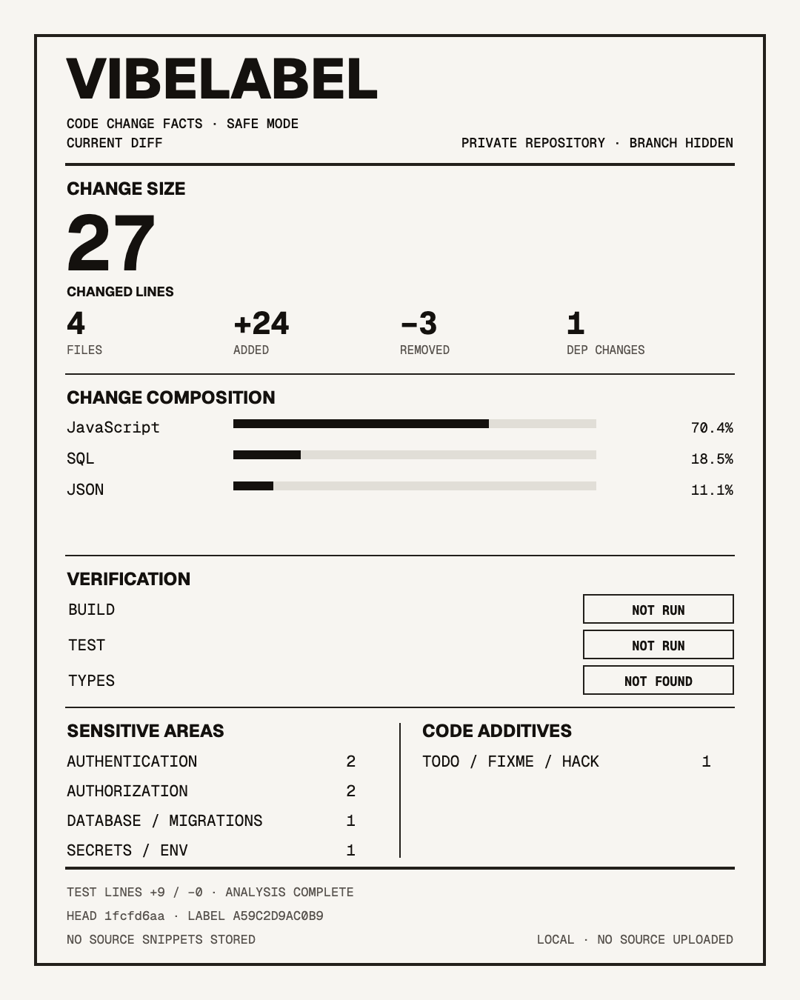

# VibeLabel

**Code change facts, not a quality score.**

VibeLabel turns a local Git diff into a shareable 4:5 code-change label. It reports what can be verified directly from the repository: changed lines, files, language composition, direct dependency changes, test-file changes, executed checks, sensitive areas, and explicit patterns on added lines.

It does not upload source code, guess whether code is AI-written, or assign a health score, grade, coverage judgment, or merge recommendation.



## Quick Start

Requirements: Git and Node.js 20 or newer. After this GitHub repository is published, run VibeLabel from any local Git repository with one command:

```bash
npx --yes github:NeoXu954/vibe-label --repo . --current --open
```

Or clone the source and run the bundled CLI directly:

```bash
git clone https://github.com/NeoXu954/vibe-label.git
cd vibe-label
node plugins/vibe-label/skills/vibe-label/scripts/vibe-label.mjs --repo /path/to/your/repo --current --open
```

The generated safe page can download a `1080 x 1350` PNG or copy a text summary. It links to a separate local `detailed.html` when repository labels are needed. The default output lives in the operating system's temporary directory, so VibeLabel does not add files to the analyzed repository.

## Scopes

| Option | Compared state | Includes |
|---|---|---|
| `--current` | `HEAD` to worktree | Staged, unstaged, untracked |
| `--staged` | `HEAD` to index | Staged only |
| `--unstaged` | Index to worktree | Unstaged and untracked |
| `--base <ref>` | `merge-base(ref, HEAD)` to `HEAD` | Committed branch changes only |

`--current` is the default. Each label prints its scope so different states are not silently mixed.

## Verified Labels

Checks only run when explicitly provided. Without them, the label says `NOT RUN` or `NOT FOUND`.

```bash
node plugins/vibe-label/skills/vibe-label/scripts/vibe-label.mjs \
  --repo /path/to/your/repo \
  --current \
  --check "BUILD=npm run build" \
  --check "TEST=npm test" \
  --check "TYPES=npm run typecheck"
```

Checks run before analysis. A failed check remains visible on the generated label and makes the CLI exit with status `2`.

## Codex Plugin

After this repository is published:

```bash
codex plugin marketplace add NeoXu954/vibe-label
codex plugin add vibe-label@vibe-label
```

Then ask Codex:

```text
Generate a safe VibeLabel for my current changes.
```

## Claude Code Plugin

```bash
claude plugin marketplace add NeoXu954/vibe-label
claude plugin install vibe-label@vibe-label
```

Then ask Claude Code:

```text
Generate a VibeLabel for my staged changes.
```

Both plugins use the same [`SKILL.md`](./plugins/vibe-label/skills/vibe-label/SKILL.md) and the same local analyzer.

## Privacy Model

VibeLabel generates three local files:

- `index.html` is the safe share surface. Repository names, branch names, and base refs are not embedded in the file.
- `detailed.html` is an opt-in local surface that includes repository and branch labels. Review it before sharing.
- Neither HTML mode includes source snippets, secret values, absolute paths, remote URLs, author names, or emails.
- `report.json` is local machine data. It includes relative file paths and direct dependency names for inspection. Do not publish it without reviewing it.

The analyzer never stores the raw diff. Secret-like values are counted and omitted. A report records rule IDs, relative paths, line numbers, and occurrence counts, never the matching source text.

VibeLabel makes no network requests and has no telemetry, account, API key, background service, post-install hook, or MCP server. Explicit `--check` commands are the only commands it runs beyond read-only Git inspection.

## What It Reports

- Numeric diff facts from Git, preserving unknown binary line counts as `null`
- Language composition based on added and deleted lines
- Direct dependency declaration changes from `package.json`, with remote URLs and local paths redacted
- Lockfiles touched, without treating lockfile entries as direct dependencies
- Added and removed lines in recognized test files
- Authentication, authorization, payments, database/migrations, secrets/environment, and deployment/CI touchpoints
- Added-line occurrences of maintenance markers, type/lint suppression, skipped or focused tests, verification bypasses, debugger/eval, and debug output
- Actual build, test, and type-check results when explicitly run

Sensitive areas are categories that changed, not vulnerability findings. Added-line patterns are observations, not defects.

## CLI Reference

```bash
node plugins/vibe-label/skills/vibe-label/scripts/vibe-label.mjs --help
```

Useful options:

```text
--repo <path>          Repository to analyze
--output <path>        Persistent output directory
--check <LABEL=CMD>    Run a named verification command; repeatable
--check-timeout <ms>   Timeout per check
--open                 Open the generated HTML
--json                 Print the machine report
```

## Development

```bash
npm test
npm run check
```

The project uses only Node.js built-in modules at runtime. Geist Sans and Geist Mono are bundled under the SIL Open Font License in [`assets/fonts`](./plugins/vibe-label/skills/vibe-label/assets/fonts/).

VibeLabel's source code is available under the [MIT License](./LICENSE).

## 中文说明

VibeLabel 是一个完全本地运行的 Codex / Claude Code 辅助工具。它把当前 Git 改动生成一张可分享的“代码配料表”，但不做 AI 代码检测、不打质量分，也不会上传源码。

默认生成的 `index.html` 不会嵌入仓库名、分支名或基准分支名；`detailed.html` 是单独的本地详细版。分享 PNG 或 HTML 前，仍建议先目视检查。`report.json` 含相对文件路径和依赖名，只用于本地分析，不应直接公开。
