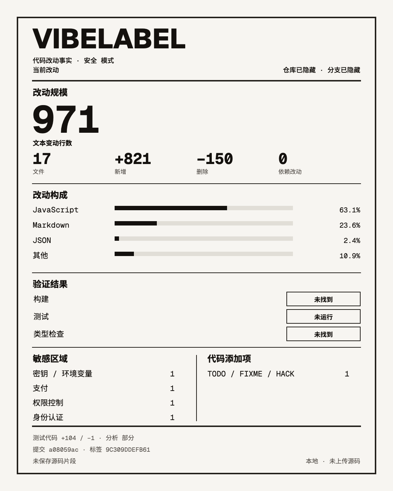

# VibeLabel

[English](./README.md) | 简体中文

**只展示代码改动事实，不做质量评分。**

VibeLabel 会把本地 Git diff 生成一张可分享的 4:5 代码改动标签。它只报告可以直接从仓库验证的信息，包括改动行数、文件、语言组成、直接依赖变化、测试文件变化、实际执行的检查、敏感区域，以及新增行中明确出现的模式。

它不会上传源码，不会猜测代码是否由 AI 编写，也不会给出健康度、等级、覆盖率判断或合并建议。



## 快速开始

需要 Git 和 Node.js 20 或更高版本。你可以在任意本地 Git 仓库中用一条命令运行 VibeLabel：

```bash
npx --yes github:NeoXu954/vibe-label --repo . --current --lang zh-CN --open
```

也可以克隆源码，直接运行项目自带的 CLI：

```bash
git clone https://github.com/NeoXu954/vibe-label.git
cd vibe-label
node plugins/vibe-label/skills/vibe-label/scripts/vibe-label.mjs --repo /path/to/your/repo --current --lang zh-CN --open
```

生成的安全版页面可以下载一张 `1080 x 1350` PNG，也可以复制文本摘要。需要仓库标签时，可以打开页面中链接的本地 `detailed.html`。默认输出目录位于操作系统的临时目录，因此 VibeLabel 不会向被分析的仓库写入文件。

## 语言

英文是默认语言。加入 `--lang zh-CN` 后，HTML 页面、PNG、操作界面和复制摘要都会使用简体中文。`report.json`、规则 ID 和分析指纹保持语言中立，不会因展示语言变化。

对于同一份 diff，英文输出继续使用原来的临时目录，中文输出会写入其下的 `zh-CN/` 子目录，因此不会相互覆盖。显式提供 `--output` 时，VibeLabel 会直接使用指定目录。

## 分析范围

| 选项 | 比较范围 | 包含内容 |
|---|---|---|
| `--current` | `HEAD` 到工作区 | 已暂存、未暂存、未跟踪 |
| `--staged` | `HEAD` 到暂存区 | 仅已暂存 |
| `--unstaged` | 暂存区到工作区 | 未暂存和未跟踪 |
| `--base <ref>` | `merge-base(ref, HEAD)` 到 `HEAD` | 仅已提交的分支改动 |

默认使用 `--current`。每张标签都会标注自己的分析范围，避免在没有提示的情况下混用不同状态。

## 验证结果

只有显式提供检查命令时，VibeLabel 才会运行检查。没有提供时，中文标签会显示“未运行”或“未找到”。

```bash
node plugins/vibe-label/skills/vibe-label/scripts/vibe-label.mjs \
  --repo /path/to/your/repo \
  --current \
  --lang zh-CN \
  --check "BUILD=npm run build" \
  --check "TEST=npm test" \
  --check "TYPES=npm run typecheck"
```

检查会在分析前运行。失败结果会保留在生成的标签中，同时 CLI 会以状态码 `2` 退出。

## Codex 插件

```bash
codex plugin marketplace add NeoXu954/vibe-label
codex plugin add vibe-label@vibe-label
```

然后对 Codex 说：

```text
为我当前的改动生成一份安全版 VibeLabel。
```

## Claude Code 插件

```bash
claude plugin marketplace add NeoXu954/vibe-label
claude plugin install vibe-label@vibe-label
```

然后对 Claude Code 说：

```text
为我已暂存的改动生成一份 VibeLabel。
```

两个插件共用同一份 [`SKILL.md`](./plugins/vibe-label/skills/vibe-label/SKILL.md) 和同一个本地分析器。

## 隐私设计

VibeLabel 会在本地生成三个文件：

- `index.html` 是用于分享的安全版页面。文件中不会嵌入仓库名、分支名或基准引用。
- `detailed.html` 是需要主动打开的本地详细版，其中包含仓库和分支标签。分享前请先检查内容。
- 两种 HTML 都不包含源码片段、密钥值、绝对路径、远程 URL、作者姓名或电子邮箱。
- `report.json` 是供本机使用的数据，其中包含相对文件路径和直接依赖名称。请勿在未检查内容的情况下发布它。

分析器不会保存原始 diff。疑似密钥的内容只计数，不记录具体值。报告只会记录规则 ID、相对路径、行号和出现次数，不会记录匹配到的源码文本。

VibeLabel 不会发起网络请求，也没有遥测、账户、API 密钥、后台服务、安装后 Hook 或 MCP 服务器。除了只读的 Git 检查外，它只会运行用户通过 `--check` 明确提供的命令。

## 报告内容

- 来自 Git 的数值类 diff 信息。二进制文件无法确定的行数会保留为 `null`
- 根据新增和删除行数统计的语言组成
- `package.json` 中直接依赖声明的变化。远程 URL 和本地路径会被隐去
- 发生变化的锁文件。锁文件条目不会被当作直接依赖
- 已识别测试文件中的新增和删除行数
- 涉及认证、授权、支付、数据库或迁移、密钥或环境配置，以及部署或 CI 的改动区域
- 新增行中出现的维护标记、类型或 lint 抑制、跳过或聚焦的测试、绕过验证、debugger 或 eval，以及调试输出
- 用户明确运行构建、测试和类型检查后产生的真实结果

敏感区域只表示哪些分类发生了变化，不代表发现了漏洞。新增行模式只是观察结果，不代表代码存在缺陷。

## CLI 参考

```bash
node plugins/vibe-label/skills/vibe-label/scripts/vibe-label.mjs --help
```

常用选项：

```text
--repo <path>          要分析的仓库
--output <path>        持久化输出目录
--check <LABEL=CMD>    运行一条具名验证命令；可重复使用
--check-timeout <ms>   每条检查命令的超时时间
--lang <locale>        展示语言：en 或 zh-CN
--open                 打开生成的 HTML
--json                 输出机器可读的报告
```

## 开发

```bash
npm test
npm run check
```

项目运行时只使用 Node.js 内置模块。Geist Sans、Geist Mono，以及仅覆盖固定界面文案的 Noto Sans SC 子集都会随项目提供，并按照 SIL Open Font License 授权，文件位于 [`assets/fonts`](./plugins/vibe-label/skills/vibe-label/assets/fonts/)。该子集可以保证 VibeLabel 自身的中文文案正常显示；详细版仓库名或分支名中的生僻字会使用本机系统字体回退。

VibeLabel 源码采用 [MIT License](./LICENSE) 许可。
